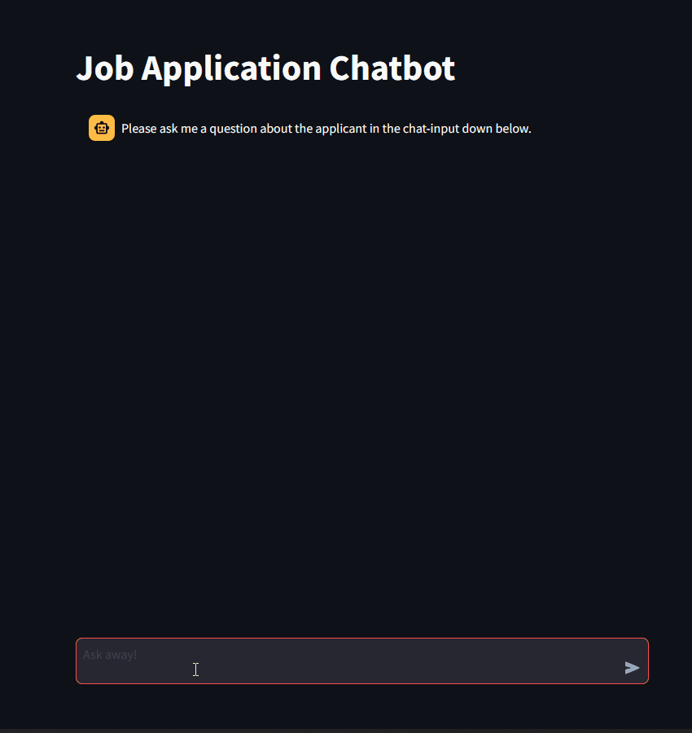

# 👩‍💼 Job Application Chatbot 👨‍💼

This is a very simple chatbot with the purpose of of representing a job applicant. As it utilizes retrieval augmented generation/ RAG, you can feed it with your own personal information, so it will be able to answer personal questions about yourself as an applicant.

[**Here you can see a hosted live demo.**](https://chatbot-8uahjmr5yxhm3dq3vaszbv.streamlit.app/)



## 💾 Creating the Vector Store
The core part of the RAG mechanism is mostly based on this [excellent tutorial](https://youtu.be/tcqEUSNCn8I?si=La6D7a_pr6SrrUcN) and the [accompanying code](https://github.com/pixegami/langchain-rag-tutorial).

The vector store is created in [create_database_pinecone.py](vector_store/create_database_pinecone.py). The library langchain was levered to split a small text document with information about the applicant into chunks. It was also used to access the OpenAI API to vectorize/ embed the chunks via the LLM GPT-3.5 Turbo. Finally langchain was used to make a call to the Pinecone API, to save the embedded  information to a vector store in the cloud.

## 💬 Querying the Vector Store
In [query_data_pinecone.py](vector_store/query_data_pinecone.py) the database can then be queried via the command line. The user inputs a prompt, which is also vectorized via ChatGPT. Based on this vectorized prompt a given amount of relevant information chunks will be retrieved from the database, i.e. via euclidian distance. So basically the nearest vectors to the embedded prompt stored in the database will be retrieved. The original prompt is then merged with the retrieved infomration chunks through the means of a simple template. There may or may not have been instructions for the AI to show the applicant in a flattering light.
```
Answer the question based only on the following context:
{retrieved chunks will be inserted here}

---

Answer the question about the applicant based on the above context: {orignal prompt will be inserted here}

If the question is off topic an there are no matching results, just ask for another
question about the applicant and tell how awesome he is. 
```

## 🎨 App/ Front-End
The front-end is based [on another tutorial](https://youtu.be/Z41pEtTAgfs?si=Qy0HjIGgzvI2fVcT) and the [associated repository](https://github.com/dataprofessor/openai-chatbot). It's a very simple set-up for a streamlit-app (framework for full-stack web-apps, fully written in python) that integrates the ChatGPT API. The original app didn't include any RAG, so some modifications had to be made. The only part of the conversation that is now kept in memory for the AI are the original prompts, not the modified prompts with the RAG context. The RAG context is only provided for the newest prompt. Also the code was modified, to only show the original prompt in the UI, not the modified one.

## ⚙️ Deployment
If you want to deploy the chatbot on your own, this is how you do it:

1. Create index and get API-Key at [Pinececone](https://www.pinecone.io/).
2. Get API-Key at [OpenAI](https://platform.openai.com/docs/overview).
3. Create at .env file at the root level of this project with the following contents:
```
OPENAI_API_KEY="your-open-ai-api-key-here"
PINECONE_INDEX_NAME="your-pinecone-index-name-here"
PINECONE_API_KEY="your-pinecone-api-key-here"
```
4. (Optional) Create you own .txt file with information about yourself and replace [sample-applicant-data.txt](/data/sample-applicant-data.txt) with your own file. Naming of the file doesn't matter and you can also split it up into multiple files. Just put it into the /data directory.
5. in terminal: ```pip install vector_store/requirements.txt```
6. in terminal: ```python vector_store/create_database_pinecone.py```
7. Create a [streamlit account](https://share.streamlit.io/) and upload [streamlit_app.py](streamlit_app/streamlit_app.py).
8. When streamlit asks you for your secrets, copy and and paste the contents of your .env file.

You are done, your chatbot is up and running!
